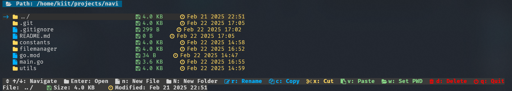

# 🚀 Navi - Modern Terminal File Manager



Navi is a lightning-fast, feature-rich terminal file manager written in Go, offering a modern and intuitive interface with Unicode icons and color-coded elements.

## ✨ Features

- 🎨 Modern UI with color coding and Unicode icons
- ⚡ Blazing fast performance
- 📁 Full file management capabilities
  - Copy, Cut, Paste operations
  - Create files and folders
  - Rename files and directories
  - Delete with confirmation
- 🎯 Intuitive keyboard navigation
- 💻 Working directory integration
- 🔍 Detailed file information display
- 🎭 Raw terminal mode for better input handling

## 🛠️ Requirements

- Go 1.19 or higher
- A terminal that supports ANSI escape sequences
- A font that supports Unicode icons (recommended: Nerd Fonts)

## 📥 Quick Installation

### Using the Install Script

```bash
curl -sSL https://raw.githubusercontent.com/Tony-ArtZ/Navi/main/install.sh | bash
```

### Manual Installation

1. Clone the repository:
```bash
git clone https://github.com/Tony-ArtZ/Navi.git
```

2. Navigate to the project directory:
```bash
cd Navi
```

3. Build the project:
```bash
go build -o navi
```

4. Install the binary:
```bash
sudo mv navi /usr/local/bin/
```

## 🎮 Controls

- `↑/↓` - Navigate through files
- `Enter` - Open directory
- `n` - Create new file
- `N` - Create new folder
- `r` - Rename file/folder
- `c` - Copy file/folder
- `p` - Toggle preview
- `x` - Cut file/folder
- `v` - Paste file/folder
- `o` - Open with default app
- `w` - Set current directory as working directory
- `d` - Delete file/folder (with confirmation)
- `q` - Quit

## 🔧 Technical Specifications

- **Performance**: O(n) file listing with minimal memory footprint
- **Terminal Handling**: Raw mode for immediate key processing
- **File Operations**: Atomic operations with error handling
- **UI Framework**: Custom-built terminal UI system
- **Dependencies**: Minimal external dependencies
- **Platform Support**: Linux, macOS (Windows support coming soon)

## 🤝 Contributing

Contributions are welcome! Please feel free to submit a Pull Request.

## 📝 License

This project is licensed under the MIT License - see the [LICENSE](LICENSE) file for details.

## 🐛 Bug Reports

Found a bug? Please open an issue on our [GitHub repository](https://github.com/Tony-ArtZ/Navi/issues).
